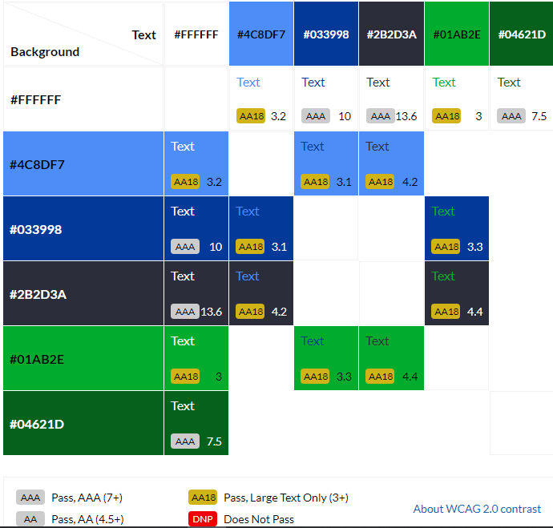

# **Geography Challenged**
## **Site Overview**

## Contents-Page:
1. [**Site Overview**](#site-overview)
1. [**Project-Planning**](#project-planning)
    * [**Target Audiences:**](#target-audiences)
    * [**User Stories**](#user-stories)
    * [**Site Objectives:**](#site-objectives)
    * [**How Is This Will Be Achieved:**](#how-will-this-be-achieved)
    * [**Wireframes**](#wireframes)
    * [**Color Scheme**](#color-scheme)
1. [**Current Features on all pages**](#current-features-on-all-pages)
    * [**Headers:**](#headers)
        * [*Title*](#Title)
        * [*Logos*](#logos)
        * [*Navigation tabs*](#navigation-tabs)
    * [**Hero Images:**](#hero-images)
      * [**Home-Page**:](#home-page)
          * [*Hero-Image*](#hero-image)
      * [**Essentials-Page**:](#essentials-page)
          * [*Hero-Image*](#hero-image-1)
    * [**Anchor Tags Within the Pages Contents**](#anchor-tags-within-the-pages-contents)
    * [**Footer**](#footer)
    * [**Typsetting**](#typesetting)
1. [**Individual Page Contents features**](#individual-page-contents-features)
    * [**Home-Page Contents**](#home-page-contents)
    * [**Essentials-Page Contents**](#essentials-page-contents)
    * [**Cardinfo-Page Contents:**](#cardinfo-page-contents)
    * [**Decks-Page Contents:**](#decks-page-contents)
    * [**How-to-play-Page Contents:**](#how-to-play-page-contents)
    * [**Banlist-Page Contents:**](#banlist-page-contents)
1. [**Potential-Features**](#future-enhancements)
1. [**Testing Phase**](#testing-phase)
1. [**Deployment**](#deployment)
1. [**Credits**](#credits)
    * [**Honorable mentions**](#honorable-mentions)
    * [**General reference:**](#general-reference)
    * [**Content**](#content)
    * [**Media**](#media)

## **Project Planning**
### **Target Audiences:**
* For users who are interesting in a playing short games.
* For users who are learning about geography.

### **Site Objectives:**
* Allowing users to know of short fun facts about geography.
* Educating the user on using this as a fun way of educating themselves.

### **User Stories:**
* As a user I want to give feedback via the given social media links to further 
improve/enhance the quiz to the owner.
* As a user I want to be able to easily navigate the quiz with ease.
* As a user I want have fun on short quizs without being bored.
* as a user I want the quiz to be as simple easy to understnd.

### **How will this be achieved:**
* The landing page with have a simple CTA (Call To Action) input button at which the user must ineteract with to continue the quiz.
* The page will have the following things:
    * A large coloured CTA play button at which when the user/player hovers over, a small animation will occur and change colours briefly tempting the user to click it which leads to a different pop up to appear.
    * A small text box which the user has to input their name to start the quiz, if nothing has been inputted the quiz cannot start.
    * A series of questions out of ten which displays the question, and four different options at which the user must pick one correct answer to see if it is correct or not.
    * A results page which gives feedback to players as to how many questions they have answered correctly out of 10. 
    
### **WireFrames:**

* In order to prevent any digression to project aim & objectives I have made a few wire frames as a plan to refer back to from in case of any major changes.

[Wireframes](doc/wireframes/) were all designed in Balsamiq desktop.
* [Desktop-Landing-Page](doc/wireframes/desktop-landing-page.png)
* [Desktop-Landing-Page](doc/wireframes/desktop-quiz-page.png)
* [Desktop-Landing-Page](doc/wireframes/desktop-results-page.png)
* [Desktop-Landing-Page](doc/wireframes/mobile-landing-page.png)
* [Desktop-Landing-Page](doc/wireframes/mobile-quiz-page.png)

There was small changes from the planned wireframes to enhance the UX (User Experience). 
Changes include:-
* An interactive CTA play button which is changes color upon hovering.
* A placeholder on the start-game section text box for players to input their names and warning to users if they start the game with no input in the text box.
* An animation on the timer clock which shows a small stop watch shake after each second to indicate the user that time is ticking.
* A hover animation over the 4 different choices of answers within the answers section of the quiz which change color whilst the animation occurs.
* The results page having a box which shows the player's score and a coloured gradient on the border of the box which constantly spins aorund the edge of the box.
* A small Favicon to act as an icon for the webpage.

### **Color Scheme:**
 * When creating the design of the quiz site I have went with this colour scheme to match the overall theme of georgraphy with the colors of the earth having blue and green elements.  

 

## **Current Features on all pages**
###  **Headers**
* The header has been placed in the top center of the page to allow for a easy transition between desktop and mobile so it doesn't affect the page in huge way. 

 The header itself contains the following features: 

### *Title:*

* The Title is there to show the name of the page.

#### *Logos:*
* The logos illustrate the site's theme and offer something to appease the user's eye by filling the blank space without distracting from the title.

    * The logo on mobile version is to make sure that the title is enalarged on a smaller screen for a better user experience. 

        

    * Whereas the logo on the desktop version is to fill as much white space as possible on a higher screen resolution for a much cleaner appearence. 

        

#### *Navigation tabs:*
* all of the navigation tabs appear on all 6 pages of the site.
* Each of the pages links to the about page, essentials, card information, decks, how to play, and the current banlist allowing for easy navigation between the tabs.
* In the image below it shows that whenever a user is on the current page it is highlighted underneath a small purple line.
* Hovering over the menu will turn the highlighted word in a different color.

  

### **Hero Images**
* I have only added the hero image on the main home-page to act as the main attraction at which people would see once they open the link.
* The image has a zoom animation to attract the user to make it more presentable. 
* Each of the iamges used in this project is within them of Yugioh or explaining the functionality of the cards.

### **Home-Page**:
#### *Hero-Image:*
The picture used in as the hero image is none other than Linkuriboh, this cute round monster has appeared on the anime series of Yu-Gi-Oh Vrains which is the first to introduce Link summoning which is later introduced in the TCG game.

### **Essentials-Page**:
#### *Hero-Image:*
the picture used for the main banner for all of the pages is from a fan based site which produce incredible wallpapers for all Yu-Gi-Oh fans.

## **Anchor Tags Within the Pages Contents**
* All anchor tags that have been used in the page's contents do not have a under-lined hyperlink.
* Instead there is a color change upon hovering the links and also a color change upon visting the pages.
* The Hoevr over effect on all th ehyper links show a red color contrast from the original gold text to indicate the user about to select a different link.
* Have a hover-over effect that turns the Hyperlink a darker color from the gold gradient used throughout the page.
* At which i have created a seperate code in style.css to show that once the user has been to the site it will change from gold to red.

## **Footer**
* The footer has direct links to all of the offcial social media accounts of the Yu-Gi-oh franchise with an open invitation to follow all channels. 

* All the icons were imported from  the font awesome site using Javascript at the bottom of the page.

* In some of the footers on the rest of the pages I have included that a disclaimer that the site that is being built is merely a fan-based site at which it acts as a guide for returning or new players interested in the franchise and that all of the stated material goes to the rightful owners of the Yu-Gi-Oh franchise of STUDIO DICE/SHUEISHA, TV TOKYO, and KONAMI.

## **Typesetting**
 Throughput the project all of the fonts that were used were primarily 
  * Oswald - for an eyecatching look.
  * Space mono- for the retro gaming effect it has.#

  * All Fonts that have been sued have been sourced from Google Fonts (as quoted in the credits)

## **Individual Page Contents features**

### **Home-Page Contents:**

* The main page gives a brief overview of what yugioh is. 
* The linked youtube video is showcasing tips and tricks on returning player son how to get better at the TCG game. 

### **Essentials-Page Contents:**

* This page gives you information at which the person needs certain resources if they choose to play th egame in real life.
* It also states the various different accessories which are available to enhance the users exeprience such as card sleeves for the added protection of the cards and the aesthetically pleasing artwork offered on said card sleeves or game mats.
* It also shows a diagram showing the different indicated numbers of the playing mat at which players have to set up their own decks.

### **Cardinfo-Page Contents:**

* This page explains on the basic structure of the card, consisting of the name, card description, the type, the attribute, level, the printed official card number, and its attack and defense points.
* below it explains the different card effects that cards have and how each one has its own use in any given situation.
 

### **Decks-Page Contents:**
* The Decks page offer fan favourites to the top tier meta cards at which many players use in various tournaments.
* Each of the cards are clickable and will send the user to an external site which will show teh user of the full deck to build, if they choose to do so.

### **How-to-play-Page Contents:**
* This is a tutorial at which it showcases a step-by-step guide on howto play the game explaining the turn systems and how toplay various different cards.
* It also explains the different scenarios at which players can tactically play at their discretion and th evarious Spell and trap icons and meanings behind the cards.

### **Banlist-Page Contents:**
* This just shows a very static list of all of the upadated various cards that have been banned in any sort of offcial competition setting by Konami.
* My Original idea was to link each of the cards to the data-base of the offcial Yu-Gi-Oh site but it will be mentioned in the [Potential-Features](#potential-features). 

## **Potential-Features**
* Due to the project deadlines being very tight urgent the project had to be scaled down to a more simpler version of the geography quiz but these are the features that i would like to potentially add or implement in the near future:
    * An initeractive version with sounds and unique animations.
    * Potentially adding a leaderboard system / table to challenge and rival other users.
    * A narration voice over for all the questions and answers for users with disablity issues.
-->
***
## **Testing-Phase**
<!--  <> [TESTING.md](TESTING.md) -->
***
## **Deployment**
The project has been deployed with the following steps: -
<!--
1. Within the project's [repository](https://github.com/leebri101/Yu-Gi-Oh-Guide), you then select the **Settings** tab.
2. Then select the **Pages** menue tab on the left side.
3. Under **Source** then, select the **Main** branch from the drop-down menu and click **Save**.
4. A message will then show that the porject has been successfully launched with the live link.

You can visit the live link via this URL - [Yu-Gi-Oh-Guide](https://leebri101.github.io/Yu-Gi-Oh-Guide/index.html)-->
***

 ## **Credits**
### **Honorable mentions**
The second project was a very interesting but difficult challenge, which tested my understanding of HTML & CSS but to incorperate JavaScript too. However the more stuff that was being introduced to the project the more simpler and effective the project became due to time restraints of the course, but nonetheless it is a good way to show what i can do, but i must credit the following people:
 * [Can Sucullu](https://github.com/cansucullu) - My Code Institute mentor who is incredible at giving me insite and suggestions on further improving my project and is a huge help to continuously support me for any sort of technical issues within the project.
* The Slack community of Code Institute for helping me the JavaScript module as it is somewhat challenging due to the deadline and questions on the module. 
* My older brother for always being available for being a personal guinea pig for my projects (and with many more to come) and giving me constant constructive feedback all the time.
* Huge thanks to my girlfriend for the constant support and nagging me to stay focussed whenever i get distacted and also giving me useful advice and insight.

### **General reference:**
* The project theme was inspired by the Code Institute's coding project called Love Maths. I have tried to change as much as possible but there may be some similarties within the codes.
* I have used W3Schools for a basic understanding and learning process for knowing JavaScript a bit better, and for general basic coding references and as general encyclopedia for any code related issues or ideas.

### **Content:**
* All icons that were used throughout the project are sourced from [Font-Awesome](https://fontawesome.com/)
* All fonts used have been imported from - [Google-Fonts](https://fonts.google.com/)

  
### **Media:**
* Background image on the home-page on index.html - [World-Globe](https://www.wallpaperflare.com/globe-world-map-earth-global-travel-planet-geography-wallpaper-akzmf/download)

* Favicon for tab of page on index.html - [Favicon-Globe](https://www.flaticon.com/free-icon/earth-globe_616616)

* General RGB color Table used in style.css - [RGB-Table](https://www.rapidtables.com/web/color/RGB_Color.html)

* Image compressions- [TinyPNG](https://tinypng.com/) 

* Colored grid scheme - [EightShapes](https://contrast-grid.eightshapes.com/)