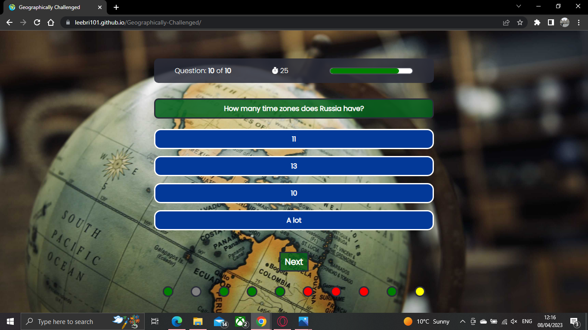
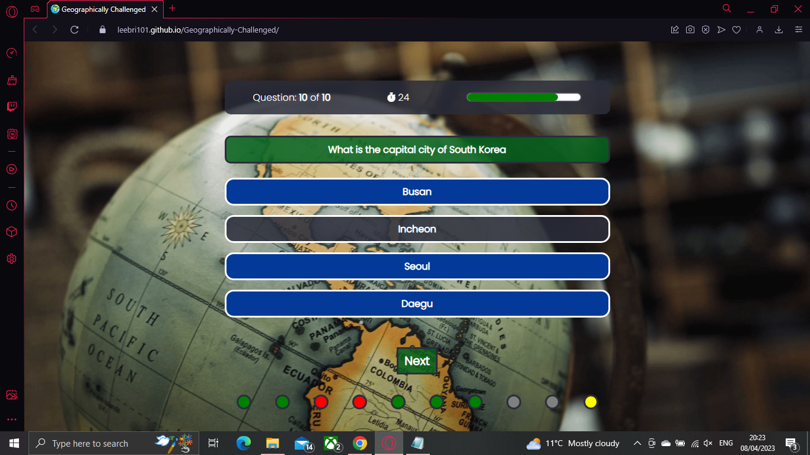
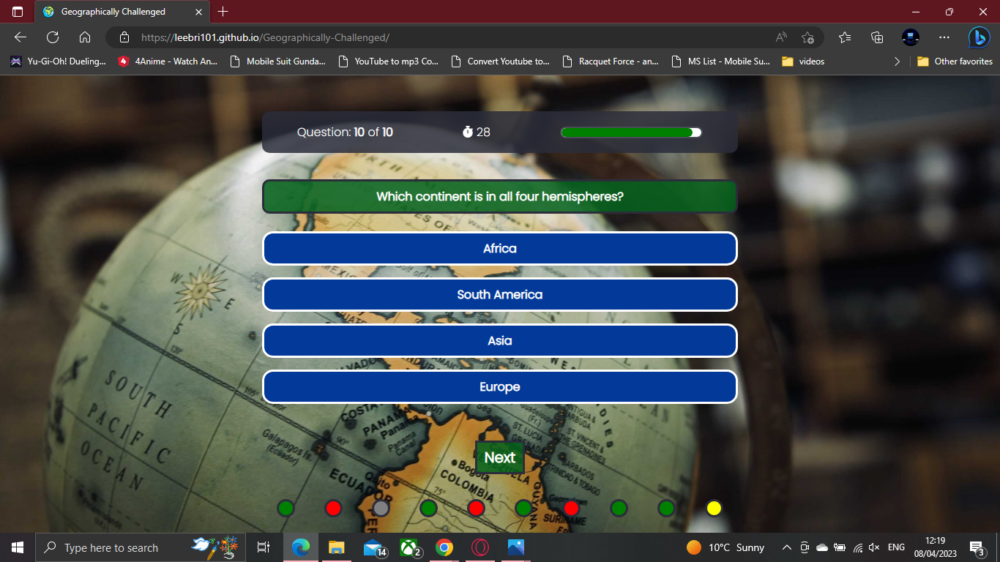

# Testing Page of Contents
* [**Development Testing Phase**](#development-testing-phase)
    * [**Manual Testing Phase**](#manual-testing-phase)
    * [**Known Issues and Bugs**](#known-issues-and-bugs)
* [**Post Development Testing-Phase**](#post-development-testing-phase)
  * [**Validator Testing**](#validator-testing)
    * [**HTML**](#html---httpsvalidatorw3orgnu)
    * [**CSS**](#css---httpsjigsaww3orgcss-validator)
  * [**Lighthouse Scoring**](#lighthouse-scoring)

## **Development Testing Phase**
During development phase, I was manually testing the site in two ways:-
    
1. Publishing the page via GitHub and sharing it with friends and family to test within a set controlled environment, and receive feedback on major and small changes that needed to be rectified.

1. Self testing to ensure that "I" as the creator know what to expect of the site.

### **Manual Testing Phase**
* During the testing phase , I used three different browsers to ensure consistency & cross-platform connectivity. The browsers used in the tests are:

  1. Chrome
  2. Opera GX
  3. Edge
* I have also asked a small group of people to test the site using Apple & Android products using safari. The users reported back with no issues with overall content but with minor styling amendmants or styling suggestions which will be implimented in the near future with further testing.

* Google Chrome: 

* Opera GX:

* Microsoft Edge:

### **Known Issues and Bugs**

* Below is the list of bugs that have been encountered in the porject and list of solutions used during the development & testing phase of the project.

* Known Issues:
  * Results issue has a grey border around teh linear gradient border.

## **Post Development Testing Phase**
### **Validator Testing**

#### **HTML** - https://validator.w3.org/nu/

* All pages have been fully tested no issues were found via URL or file upload.

#### **CSS** - https://jigsaw.w3.org/css-validator/

* CSS page has been tested, no issues found via URL or file upload.\

### **Lighthouse Scoring**

### **Testing Conditions:**
* I have git sran the tests for mobile and desktop. 
* I have asked a small group of people to run lighthouse tests from their own devices. 

#### **Desktop Version:**
I have only included a screenshot for desktop as all pages were the same score, only changing by one or two points in performance if I ran it multiple times. 

 

**Maintaining the score:**

#### **Mobile Version:**

[Go back to README.md](README.md)