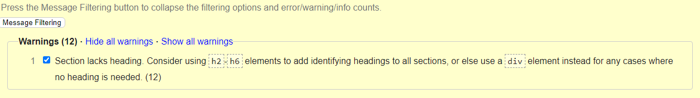
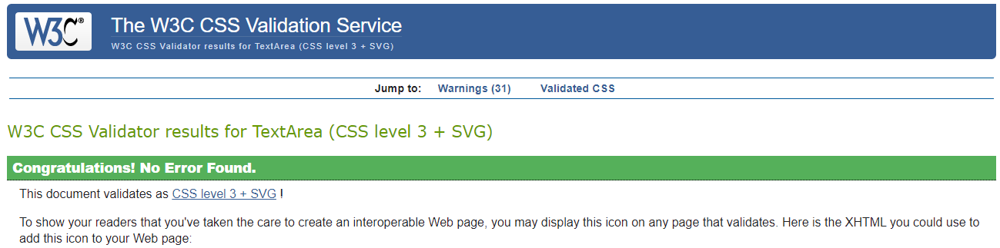

# Testing Page of Contents
* [**Development Testing Phase**](#development-testing-phase)
    * [**Manual Testing Phase**](#manual-testing-phase)
    * [**Known Issues**](#known-issues)
* [**Post Development Testing-Phase**](#post-development-testing-phase)
  * [**Validator Testing**](#validator-testing)
    * [**HTML**](#html---httpsvalidatorw3orgnu)
    * [**CSS**](#css---httpsjigsaww3orgcss-validator)
  * [**Lighthouse Scoring**](#lighthouse-scoring)

## **Development Testing Phase**
During development phase, I was manually testing the site in two ways:-
    
1. Publishing the page via GitHub and sharing it with friends and family to test within a set controlled environment, and receive feedback on major and small changes that needed to be rectified.

1. Self testing to ensure that "I" as the creator know what to expect of the site.

### **Manual Testing Phase**
* During the testing phase , I used three different browsers to ensure consistency & cross-platform connectivity. The browsers used in the tests are:

  1. Chrome
  2. Opera GX
  3. Edge
  
* I have also asked a small group of people to test the site using Apple & Android products using safari. The users reported back with no issues with overall content but with minor styling amendmants or styling suggestions which will be implimented in the near future with further testing.

* Google Chrome: 

* Opera GX:

* Microsoft Edge:

### **Known Issues**
* Below is the list of bugs that have been encountered in the project and list of solutions used during the development & testing phase of the project.

* Known Issues:
  * Results issue has a grey border around teh linear gradient border.
  * users can score more than 10 if they get all thw answers correct
## **Post Development Testing Phase**
### **Validator Testing**

#### **HTML** - https://validator.w3.org/nu/

* 0 major errors, 12 warnings have been found mostly due to the lack of headings for the HTML file.

#### **CSS** - https://jigsaw.w3.org/css-validator/

* CSS page has been tested, no issues found via URL or file upload.

### **Lighthouse Scoring**

### **Testing Conditions:**
* I have ran tests for the quiz the on mobile and desktop and with different brand devices to see if there are any issues.
* I have asked a small group of people to run lighthouse tests from their own devices. all have no issues via deskstop only mobile is slightly underperforming at 86% 

#### **Desktop Version:**
* No issues with desktop lighthouse score all performing above 90%.

**Maintaining the score:**

#### **Mobile Version:**
* The only main issue withthe mobile scoring is that origanlly it scored 81.
* Due to it being a JPEG file or either a PNG file.
* But converting the JPEG file to a PNG file did help increase the score from 81 to 86. 
* But overall the quiz is fully fucntion with no issues except rendering and imagery. 

[Go back to README.md](README.md)